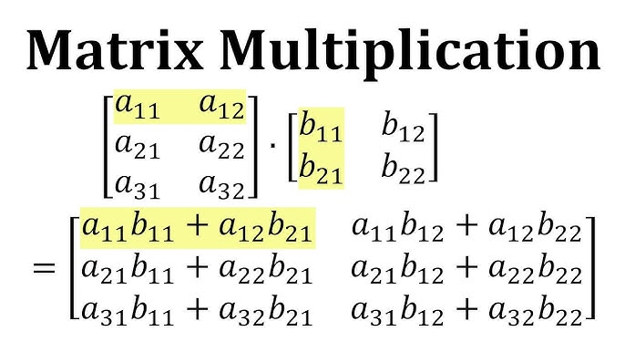

# [Matrix Multiplication](https://leetgpu.com/challenges/matrix-multiplication)

> **NOTE**: We have covered the basics of GPU programming in [Vector Addition](../01_VectorAddition/README.md). That would be a good place to start before going through this solution.

Go through the problem description before diving into the solution.

## Solving

To solve this question we will have to remind ourselves how matrix multiplication works.



Based on this, lets calculate the thread ids (tid) for our kernel. 


```C++
__global__ void matrix_multiplication_kernel(const float* A, const float* B, float* C, int M, int N, int K) {
    int col = blockIdx.x * blockDim.x + threadIdx.x;
    int row = blockIdx.y * blockDim.y + threadIdx.y;
}
```

One thing to note here is that the x-Dimensions are being used for the calculation of the columns and the y-Dimensions are being used for the calculation of the rows. In my opinion this is a little bit counter intuitive.

The best way to imagine this is when you think of 1-dimension, we always mark the space with x. When we move to 2-dimensions, then the second dimension is represented by y. In a 2-D matrix, the first dimension is a single array and the second dimension is when you bring multiple arrays together. So, `x` should be iterating over the elements of a single array and `y` should be pointing to the targetted array in which you are looking for an element. Hence `x` becomes columns and `y` becomes rows.

Now, for the calculation

```C++
__global__ void matrix_multiplication_kernel(const float* A, const float* B, float* C, int M, int N, int K) {
    int col = blockIdx.x * blockDim.x + threadIdx.x;
    int row = blockIdx.y * blockDim.y + threadIdx.y;

    if(row < M and col < K) {
        float res = 0.0f;
        for(int i = 0; i < N; i++) {
            res += A[row * N + i] * B[i * K + col];
        }
        C[row * K + col] = res;
    }
}
```

You can see that in the signature of the kernel `matrix_multiplication_kernel`, the matrix is represented as a float pointer. This simply means that we will have to think of representing a 2D matrix in a 1D manner. Lets flatten a 2D Matrix:

```
# 4x3 matrix

a e i
b f j
c g k
d h l

# flattening it

a e i | b f j | c g k | d h l
```

to represent `g` in the 2D matrix we would point to `Matrix[2][1]` (in 0 indexing). in 1D we would use the `<offset> + column`. The offset would simply be `row * size_of_each_row`, making the complete formula `row * size_of_each_row + column`. For `g`, it would be `(2 * 3 + 1) = 7`. This checks out. Keep in mind that size of each row is nothing but total number of columns. So, the calculation could also be represented as `row * tota_number_of_columns + column`

## Putting all together

also found in [solution.cu](solution.cu) file.

```C++
#include <cuda_runtime.h>

__global__ void matrix_multiplication_kernel(const float* A, const float* B, float* C, int M, int N, int K) {
    int col = blockIdx.x * blockDim.x + threadIdx.x;
    int row = blockIdx.y * blockDim.y + threadIdx.y;

    if(row < M and col < K) {
        float res = 0.0f;
        for(int i = 0; i < N; i++) {
            res += A[row * N + i] * B[i * K + col];
        }
        C[row * K + col] = res;
    }
}

// A, B, C are device pointers (i.e. pointers to memory on the GPU)
extern "C" void solve(const float* A, const float* B, float* C, int M, int N, int K) {
    dim3 threadsPerBlock(16, 16);
    dim3 blocksPerGrid((K + threadsPerBlock.x - 1) / threadsPerBlock.x,
                       (M + threadsPerBlock.y - 1) / threadsPerBlock.y);

    matrix_multiplication_kernel<<<blocksPerGrid, threadsPerBlock>>>(A, B, C, M, N, K);
    cudaDeviceSynchronize();
}
```